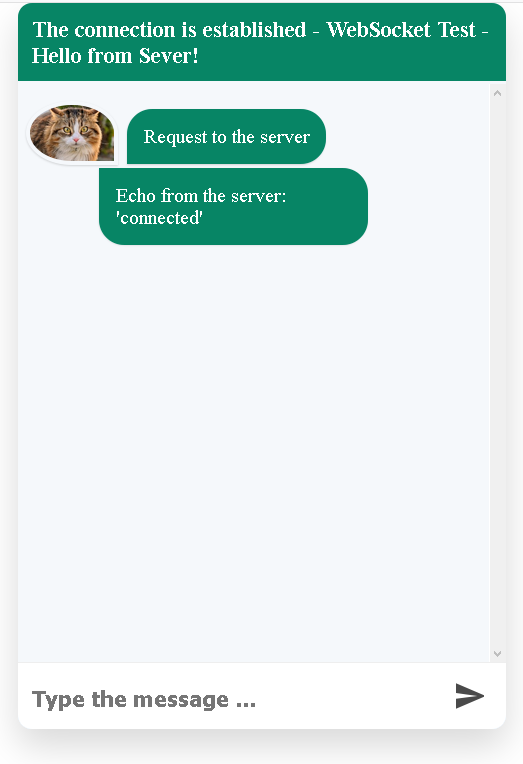

## WebSocket Client (React) + Server(Node http server)  

Example exchange test messages according to the protocol WebSocket between the client application (React) and the server (Node http echo-server)

  

